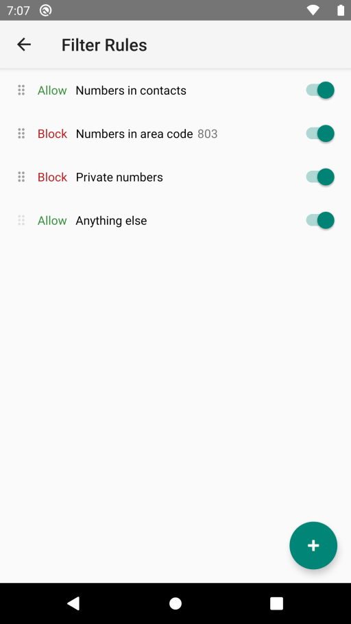
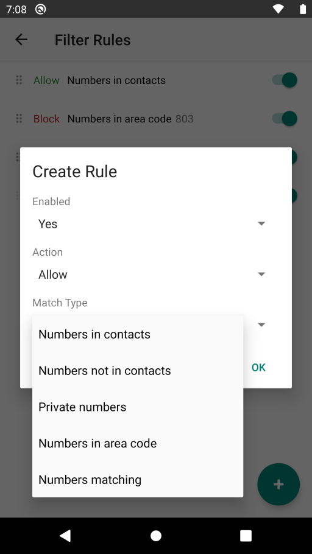
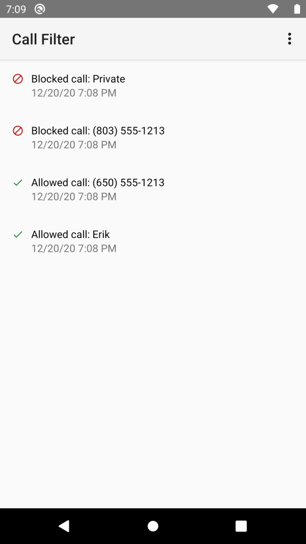

# Call Filter

An Android app to reject calls from numbers matching various conditions.

  

## Build

Use [Android Studio](https://developer.android.com/studio)

## Releases

Releases are automated via GitHub Actions. Pushing a tag matching `v<major>.<minor>.<patch>` (e.g. `v1.2.3`) runs unit tests, builds a signed release APK, and publishes it as a [GitHub Release](https://github.com/erik-perri/android-call-filter/releases).

Build provenance is attested so you can verify an APK was built from this repository with the [GitHub CLI](https://github.com/cli/cli) tool:

```bash
gh attestation verify call-filter-<version>.apk -R erik-perri/android-call-filter
```

## Issues

 * On Android versions before Q (API v29) the app does not always get notified about a call to reject it before the ringer can start.  This is fixed in Q with the [CallScreeningService](https://developer.android.com/reference/android/telecom/CallScreeningService.html) API.
 * On Android versions before Lollipop (API v21) the app must run as a system app to block calls.

## License

[MIT](https://opensource.org/licenses/MIT)
